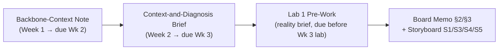

# IE-GY 9113B — Systems Integration: From ERP to Agentic AI

Vault home / map of content. Capstone company: **Sweetgreen** (Order-to-Cash process).

## Course-wide references

- [[Syllabus and Rubrics/IE-GY_9113B_Systems_Integration_Syllabus_Master_Brightspace|Syllabus]]
- [[Syllabus and Rubrics/IE-GY_9113B_Assessment_Rubrics_v1|Assessment Rubrics]]
- [[Final Project Info/IE-GY_9113B_Capstone_Kit_Orientation_v1|Capstone Kit Orientation]]
- [[Final Project Info/IEGY_9113B_Capstone_Storyboard_v2|Capstone Storyboard]]
- [[announcements|Course announcements]]

## Weekly course materials

| Week | Study note | Slides / other |
|---|---|---|
| Week 0 (optional) | [[w0/W0_ERPFloor_Course Primer\|The ERP Floor — pre-course primer]] | — |
| Week 1 — The Integration Backbone | [[w1/W01_IntegrationBackbone_StudyNote_PB14\|study note]] | [[w1/W1_IntegrationBackbone_Slides_v3\|slides]] |
| Week 2 — Failure to Leverage | [[w2/W02_FailureToLeverage_StudyNote_v6\|study note]] | [[w2/W2_FailureToLeverage_Lecure Notes_v9\|lecture notes]] |
| Week 3 — Lab 1: Diagnose & Map a Process | [[w3/IE-GY-9113B_Lab1_StudyNote\|study note]] | [[w3/W3_Lab1_Lecture-Notes\|lecture notes]] |

## Sweetgreen capstone deliverables

All Sweetgreen deliverables live in `project/`, separate from the week-by-week course materials. They build on each other in order:

| Deliverable | Due | Note |
|---|---|---|
| Backbone-context note | Week 2 | [[project/Backbone-Context-Note-Sweetgreen]] |
| Context-and-diagnosis brief | Week 3 | [[project/Context-and-Diagnosis-Brief-Sweetgreen]] |
| Lab 1 pre-work (reality brief) | Before Week 3 lab | [[project/Lab1-Prework-Sweetgreen]] |
| Lab 1 process map (in progress) | Week 3 lab | [[project/Lab1-Process-Map-Sweetgreen]] |
| Breakout scratch notes | Ongoing | [[project/Agentic AI Project]] |
| Public research log | Ongoing | [[project/research/Sweetgreen-Public-Research]] |

## Open-task checklist (from the announcements)

- [x] Convert all course PDFs to Markdown, then remove the PDFs
- [x] Draft Week 1 backbone-context note (Sweetgreen)
- [x] Draft Week 2 context-and-diagnosis brief (Sweetgreen)
- [x] Draft Lab 1 pre-work / reality brief (Sweetgreen)
- [ ] Send Week 1 + Week 2 notes to the professor by email before the Sep 18 lab (`ec5743@nyu.edu`)
- [ ] Set up/confirm free accounts: Miro or Lucidchart, Airtable or Google Sheets + Gemini
- [ ] Optional stretch: sketch the process map at home (control/decision points) and draft the friction chain before class — see [[project/Lab1-Prework-Sweetgreen]] §3 for a first draft to refine
- [ ] Team stack path declared by end of Week 3

## Vault conventions

See `ROBOT.md` at the repo root for how notes are structured, tagged, and maintained.
