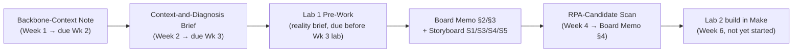

# IE-GY 9113B — Systems Integration: From ERP to Agentic AI

Vault home / map of content. Capstone company: **Sweetgreen** (Order-to-Cash process).

## Course-wide references

Raw, professor-provided reference material — see `raw/data/pdf/` and `raw/data/markdown/` in [[ROBOT]] for the layer this belongs to. Each linked Markdown note has a matching original PDF at the same topic folder + basename under `raw/data/pdf/`, kept for anything the Markdown conversion couldn't carry over.

- [[IE-GY_9113B_Systems_Integration_Syllabus_Master_Brightspace|Syllabus]]
- [[IE-GY_9113B_Assessment_Rubrics_v1|Assessment Rubrics]]
- [[IE-GY_9113B_Capstone_Kit_Orientation_v1|Capstone Kit Orientation]]
- [[IEGY_9113B_Capstone_Storyboard_v2|Capstone Storyboard]]
- `raw/data/pdf/final-project-info/Final Project Teams.pdf` — team assignments; kept as a raw PDF only, not converted or excerpted, since it names other students
- [[announcements|Course announcements]]

## Weekly course materials

Also raw — Markdown at `raw/data/markdown/course-weeks/`, each converted from the matching Brightspace PDF at `raw/data/pdf/course-weeks/` (same topic folder, same basename).

| Week | Study note | Slides / other |
|---|---|---|
| Week 0 (optional) | [[W0_ERPFloor_Course Primer\|The ERP Floor — pre-course primer]] | — |
| Week 1 — The Integration Backbone | [[W01_IntegrationBackbone_StudyNote_PB14\|study note]] | [[W1_IntegrationBackbone_Slides_v3\|slides]] |
| Week 2 — Failure to Leverage | [[W02_FailureToLeverage_StudyNote_v6\|study note]] | [[W2_FailureToLeverage_Lecure Notes_v9\|lecture notes]] |
| Week 3 — Lab 1: Diagnose & Map a Process | [[IE-GY-9113B_Lab1_StudyNote\|study note]] | [[W3_Lab1_Lecture-Notes\|lecture notes]] |
| Week 4 — RPA: The Tactical Integration Layer | [[W04_RPA_StudyNote\|study note]] | — |

## Sweetgreen capstone deliverables

All Sweetgreen deliverables live in `wiki/project/` (the LLM-maintained layer), separate from the raw week-by-week course materials. They build on each other in order:

| Deliverable | Due | Note |
|---|---|---|
| Backbone-context note | Week 2 | [[Backbone-Context-Note-Sweetgreen]] |
| Context-and-diagnosis brief | Week 3 | [[Context-and-Diagnosis-Brief-Sweetgreen]] |
| Lab 1 pre-work (reality brief) | Before Week 3 lab | [[Lab1-Prework-Sweetgreen]] |
| Lab 1 process map, curveball, and data sandbox | Week 3 lab, sharpened Week 4 post-checkpoint | [[Lab1-Process-Map-Sweetgreen]] |
| RPA-candidate scan (Board Memo §4) | Week 4 | [[RPA-Candidate-Scan-Sweetgreen]] |
| Board presentation deck (living, filled in lab by lab) | Ongoing | `wiki/project/Board-Presentation-Sweetgreen.pptx` |
| Lab 1 presentation (standalone, to present in class) | Week 3 lab | `wiki/project/Lab1-Presentation-Sweetgreen.pptx` |
| Public research log | Ongoing | [[Sweetgreen-Public-Research]] |

Raw material feeding these: [[Sweetgreen-Breakout-Scratch-Notes]] (in-class scratch work, `raw/data/scratch-notes/`), [[Sweetgreen-Lab1-Sandbox.xlsx|the Gemini-generated Lab 1 sandbox]] (`raw/data/datasets/`), and the team's graded final annotated map — PDF at `raw/data/pdf/sweetgreen-lab1-evidence/`, transcribed at `raw/data/markdown/sweetgreen-lab1-evidence/`, and its content also folded into [[Lab1-Process-Map-Sweetgreen]] (control register, friction chain, diagnosis).

## Concepts, entities, and comparisons

The vault's running glossary and cross-reference layer — kept current instead of re-defined inline every time something is used. All under `wiki/`; see "The vault as an LLM wiki" in [[ROBOT]] for how this layer is maintained.

**Concepts** (`wiki/concepts/`): [[Control Point]] · [[Decision Point]] · [[Leverage Gap]] · [[Obliterate Then Automate]] · [[RPA Candidate Criteria]] · [[Four Lenses]] · [[Three Threads]] · [[Four Archetypes]]

**Entities** (`wiki/entities/`): [[Sweetgreen]] · [[Thermo Fisher Scientific]] · [[Bailey Hydraulics]]

**Comparisons** (`wiki/comparisons/`): [[RPA vs Traditional Automation vs AI]]

## Open-task checklist (from the announcements)

- [x] Convert all course PDFs to Markdown, keeping both (paired by basename under `raw/data/pdf/` and `raw/data/markdown/`)
- [x] Draft Week 1 backbone-context note (Sweetgreen)
- [x] Draft Week 2 context-and-diagnosis brief (Sweetgreen)
- [x] Draft Lab 1 pre-work / reality brief (Sweetgreen)
- [x] Sharpen Lab 1 deliverable post-checkpoint (specific control-point register, one-page diagnosis) and share the updated version with the professor before the Sep 25 class
- [x] Draft the Week 4 RPA-candidate scan (Board Memo §4)
- [ ] Send Week 1 + Week 2 notes to the professor by email before the Sep 18 lab (`ec5743@nyu.edu`)
- [ ] Set up/confirm free accounts: Miro or Lucidchart, Airtable or Google Sheets + Gemini
- [ ] Make account, before Lab 2 (Week 6)
- [ ] Team stack path declared by end of Week 3

## Vault conventions

See `ROBOT.md` at the repo root for how notes are structured, tagged, and maintained.
