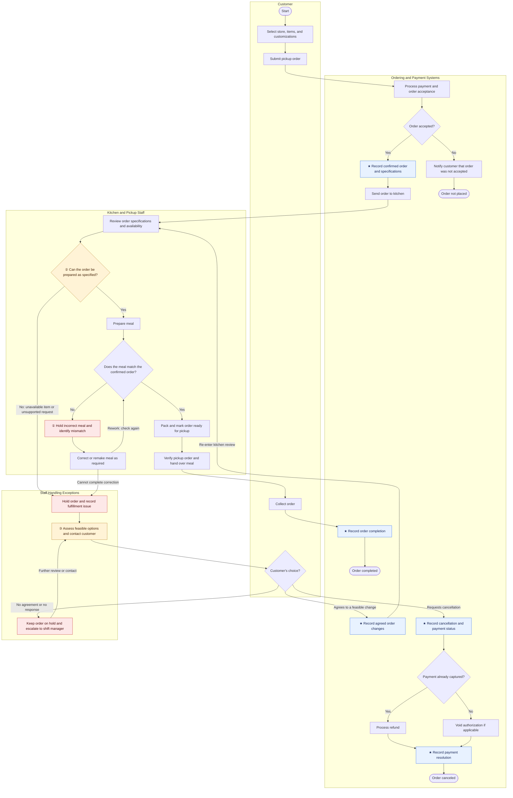

# Lab 1 Process Map — Order and Payment (Sweetgreen)

> The in-class BPMN build from [[W3_Lab1_Lecture-Notes|Lab 1]], move ① ("Map the real process") and ② ("Mark three diagnostic points"), applied to [[Lab1-Prework-Sweetgreen|the pre-work reality brief]]'s core thesis: the handoff between digital ordering and kitchen execution. Status: map + three diagnostic points done; **curveball exercise (move ③) in progress** — see open thread below.

## The annotated map

**Legend:** ★ control point (where data is born/committed) · ①②③ the three diagnostic points · shaded blue = control point, amber = diagnostic point, red = exception-handling node.

## The three diagnostic points

| # | Point | Type | Lens tag | Routes to |
|---|---|---|---|---|
| ① | Hold incorrect meal and identify mismatch (`L`) | Worst friction — the rework loop when the finished meal doesn't match the confirmed order | Quality / Operations & Supply Chain | — |
| ② | Can the order be prepared as specified? (`I`) | Stable-rules decision point — availability/feasibility check against a known ruleset | Operations & Supply Chain | **Lab 2 (Make)** — automate first |
| ③ | Assess feasible options and contact customer (`S`) | Judgment decision point — no clean rule for which substitution/compromise to offer, or when to escalate vs. hold | Customer | **Lab 3 (Relevance AI)** |

## Why this map matches the capstone thesis

This directly operationalizes the throughline from [[Backbone-Context-Note-Sweetgreen]] and [[Context-and-Diagnosis-Brief-Sweetgreen]]: the backbone's weakest point is the handoff between digital ordering and kitchen execution. On this map that handoff is literally the arrow from `G` (send order to kitchen) into `H`/`I` (kitchen review and feasibility check) — and it's exactly where the process forks into the worst-friction rework loop (①) and the judgment-heavy exception path (②→③→`Q`/`S`/`T`/`R`). The rejection/rework path (`Q → S → R` and `M → K` loop) is where — per the lecture notes' anti-pattern warning — "the cost hides"; this map has one, so it reflects the real process rather than the idealized one.

This also lines up with the primary-source evidence gathered in [[research/Sweetgreen-Public-Research|the public research log]]: the CEO's own order-accuracy math (§1) and the two independently-sourced kiosk/ordering-friction incidents (§4, §6) both point at the same seam this map isolates — the point where a digitally-placed order meets kitchen execution capacity and either holds together or doesn't.

## Open thread — curveball exercise (Lab 1 move ③, in progress)

Not yet resolved. Per [[W3_Lab1_Lecture-Notes]], next step is to pick one curveball from the deck and revise this map/diagnosis to absorb it — usually by adding a new rejection path or changing how an existing decision point behaves. Candidates most relevant to this map, given the confirmed backbone (Olo → PAR Brink → Crunchtime + Wonder-owned Infinite Kitchen → Salesforce):

- **#1 Hidden legacy system** or **#3 Nightly batch, not real time** — plausible given store-level menu/availability data may not sync in real time to the ordering layer, which would directly stress decision point ② (feasibility check running on stale availability data).
- **#2 Acquisition's parallel data** — less obviously applicable (no recent acquisition in the confirmed backbone) unless framed around the Wonder divestiture creating a *second* system of record for Infinite-Kitchen stores.
- **#6 The compliance hold** — plausible via food-safety/allergen sign-off, but weaker fit to the digital-ordering thesis than #1/#3.

Decide and record here once chosen; then update the map above to show the new/changed path.
