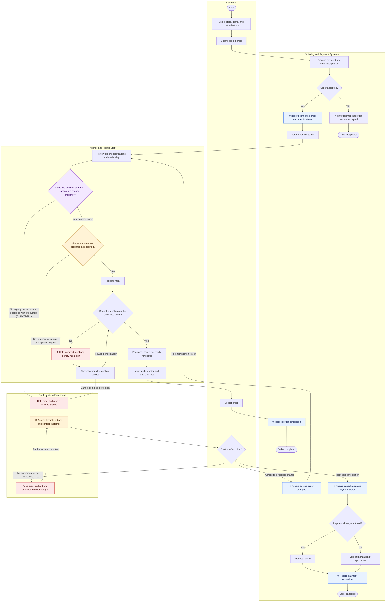

# Order and Payment Process Map (Sweetgreen)

> Diagram only. Diagnostic points, the three-point table, and the write-up live in [[Lab1-Process-Map-Sweetgreen]] — this note exists so the diagram can be embedded and edited on its own.
>
> **Post-curveball.** Node `STALE` and its edges were added to absorb the curveball: deck card #3, "nightly batch, not real time." Availability data at decision ② now comes from two sources, a live system and a nightly legacy cache, and they don't always agree. See [[Lab1-Process-Map-Sweetgreen]] for the full reasoning and the data that confirms this is the curveball actually modeled in the sandbox.
>
> An annotated, presentation-ready version of this map (control-point IDs, decision labels, lab markers) is at `assets/Order-and-Payment-Process-Map-Annotated.png`.

**Legend:** ★ control point (where data is born/committed) · ①②③ the three diagnostic points · shaded blue = control point, amber = diagnostic point, red = exception-handling node, **shaded purple = added to absorb the curveball** (live vs. nightly-cached availability freshness check).

## Annotated reference (pre-curveball state)

Presentation-ready version with control-point IDs (CP1–CP6), decision labels (D1–D3), and the friction chain overlaid, generated before the curveball was absorbed into the mermaid source above. Control points and decisions map onto the tables in [[Lab1-Process-Map-Sweetgreen]].

![[Order-and-Payment-Process-Map-Annotated.png]]

A diagram-only crop (no side panel of CP/D reference text) is at `assets/Order-and-Payment-Process-Map-Diagram-Only.png` — this is the version used on slide S5 of `project/Board-Presentation-Sweetgreen.pptx`, since the full annotated page's reference text is illegible at slide scale and duplicates the tables above.

![[Order-and-Payment-Process-Map-Diagram-Only.png]]
