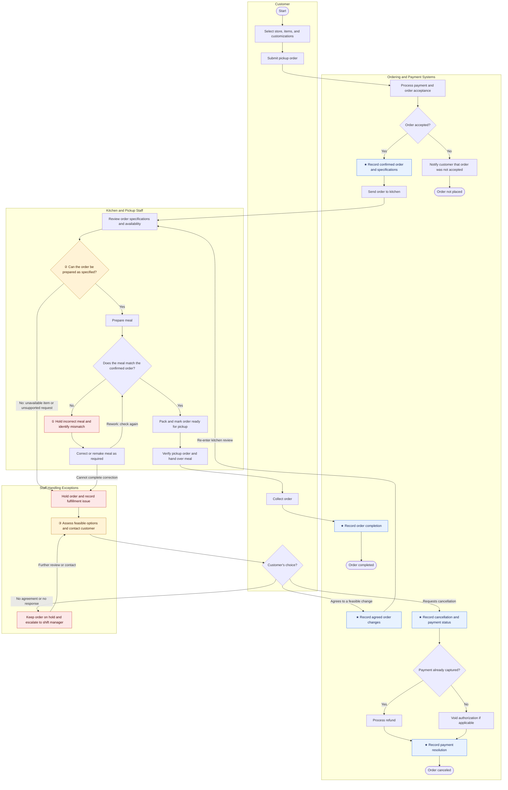

# Order and Payment Process Map (Sweetgreen)

> Diagram only. Diagnostic points, the three-point table, and the write-up live in [[Lab1-Process-Map-Sweetgreen]] — this note exists so the diagram can be embedded and edited on its own.

**Legend:** ★ control point (where data is born/committed) · ①②③ the three diagnostic points · shaded blue = control point, amber = diagnostic point, red = exception-handling node.
