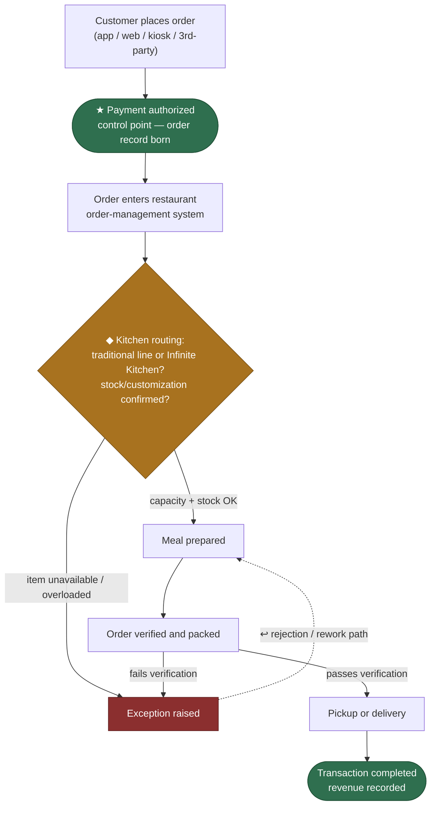
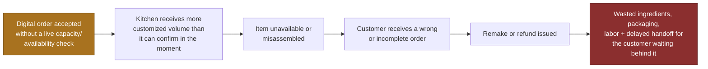

# Lab 1 Pre-Work — Reality Brief (Sweetgreen)

> ½–1 page pre-work per the [[IE-GY-9113B_Lab1_StudyNote|Lab 1 study note]] §3: pick a company, research the pain via the Four Lenses, draft first-pass hypotheses. Builds directly on [[Backbone-Context-Note-Sweetgreen]] and [[Context-and-Diagnosis-Brief-Sweetgreen]]. This is the raw material for the in-class build — not a finished map.

## 1 · Reality brief (one paragraph)

Sweetgreen is a fast-casual restaurant company (large multi-unit, vertical/food-service archetype) selling customizable salads, bowls, wraps, and protein plates through owned digital channels (app, website, in-store), and third-party delivery platforms. Its backbone is most likely a stitched SaaS stack — no single named ERP — spanning ordering, payment, restaurant order management, kitchen execution (traditional line or Infinite Kitchen), fulfillment, and financial reporting, with the general ledger as the confirmed single source of truth and operational data (menu/availability/status) probably fragmented across channel- and store-level systems (legacy/assumption, flagged for validation in class). Digital channels drove 61.8% of FY2025 revenue, so this is not a side channel — it is most of the demand. The thread I suspect hurts most: **Operations & Supply Chain** (kitchen throughput and ingredient/menu availability), closely tied to **Customer** (order accuracy and promised-time reliability).

## 2 · Research the pain — Four Lenses (first pass)

| Lens | Value leak | Thread |
|---|---|---|
| Frustration | Ingredient/menu unavailability and substitutions aren't consistently communicated across channels | Customer |
| Time | App, web, in-store, and delivery orders compete for the same kitchen capacity at peak | Operations |
| Cost | Wrong/delayed/canceled orders trigger remakes, refunds, extra packaging and labor | Operations + Cash |
| Quality | Customization details don't reliably survive from channel → kitchen → handoff | Customer + Operations |

**Sourcing:** Sweetgreen FY2025 results (digital revenue mix), Sweetgreen product/operations recruiting materials (which explicitly name order accuracy, menu availability, third-party platform performance, and "86'ing" workflows as live coordination problems), and public reporting on Infinite Kitchen throughput/accuracy gains. Everything else here is a **labelled assumption** to test in the lab.

## 3 · First-pass hypotheses

**Top 2–3 suspected pain points** (ranked):
1. **Order accuracy at the channel→kitchen handoff** — the biggest cross-lens overlap; customization/availability information doesn't reliably survive from digital order to physical prep.
2. **Peak-period kitchen congestion** — digital, delivery, and walk-in demand converge on fixed kitchen capacity with no visible shared throttle.
3. **Traditional line vs. Infinite Kitchen inconsistency** — the same order type may be handled differently depending on which kitchen format it lands on.

**Flow to map in class (Order-to-Cash):**

- **★ control point** (green) = payment authorization and transaction completion — where a committed, owned fact is born.
- **◆ decision point** (amber) = kitchen-format/availability routing — where the process forks.
- **↩ rejection/rework path** (red, dashed) = failed verification loops back to prep for a remake.

**Rough friction chain (written before consulting the pattern library, per the sequence rule):**

> Digital order accepted without a live capacity/availability check → kitchen receives more customized volume than it can confirm at that moment → an item is unavailable or misassembled → customer receives a wrong/incomplete order → remake or refund issued → wasted ingredients, packaging, and labor, plus a delayed handoff for the customer waiting behind it.

**First read — functional vs. technical requirements:**
- *Functional:* every channel must show the same real-time availability; promised completion time must reflect actual kitchen load; an order's exception path must be traceable end-to-end.
- *Technical:* one order record both kitchen formats read/write to; a live capacity signal feeding channel-facing time estimates; a shared availability state instead of per-channel menu caches.

**Two decision-point targets to bring into Lab 2/3 (per the course's forward-seeding):**
- The **kitchen-format/availability routing decision** (stable-rules candidate → Lab 2 automation).
- The **remake/refund judgment call** when an order fails verification (judgment candidate → Lab 3 agent).

---
**Status:** pre-work only — a first pass to sharpen in the Week 3 lab, not the finished map. Carries [[Backbone-Context-Note-Sweetgreen]] and [[Context-and-Diagnosis-Brief-Sweetgreen]] into Board Memo §3 (Integration Backbone Assessment) and deck slide S5.
